# Convolution Mask-엑셀

### 엑셀로 계산해보는 Convolution mask 적용법

11X11 영상이 있다고 하자.

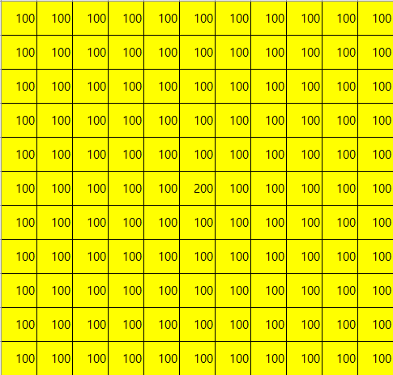

Convolution Mask(각 칸에는 1/9가 들어가 있음.)

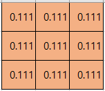

마스크를 적용했을 때 값이 적용되어 들어갈 가운데 값에 `SUMPRODUCT(A1:C3,$M$1:$O$3)` 이렇게 계산을 넣어준다.

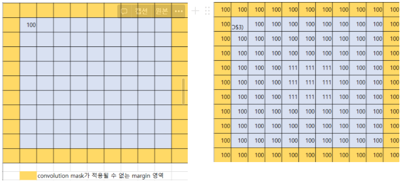

결과를 보면 원본영상 가운데에 200으로 튀던 화소값 하나가 마스크를 씌운 후 적용된 결과를 보니 여러개로 퍼진걸 확인할 수 있다.

→ 원본영상에서는 주변 화소값과 가운데 화소값의 차이가 “100”이나 났는데 마스크를 적용시키고 난 후에 주변 화소값과의 차이가 “11”밖에 안 난다는 것을 확인할 수 있었음.

→ 결론적으로, 이는 Low-pass Filter임을 알 수 있음. 고주파 성분은 걸러내고 저주파 성분만 패스시키는 방식

### Prewitt -x 방식을 한번 해보자

반은 100 반은 200으로 채워져있는 원본 영상이다.

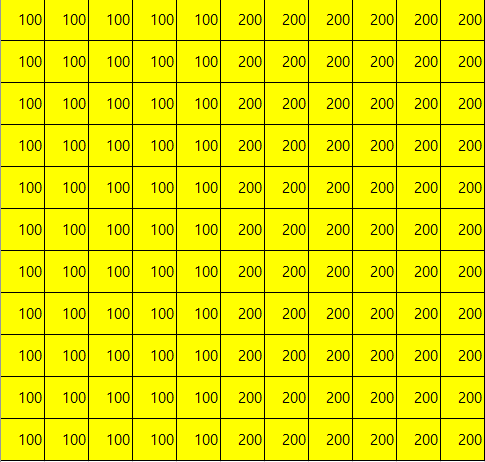

Prewitt -x 마스크를 만들어보았다 이를 적용해 볼 것이다.

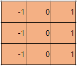

그렇게 하면 100에서 200으로 급격하게 화소값이 바뀌는 구간, 고주파가 지나가는 구간을 추출해주는 것을 확인할 수 있다. → 경계값을 출력할 수 있는 것

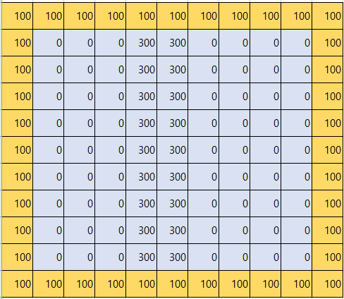

**Prewitt -x 마스크의 특징**

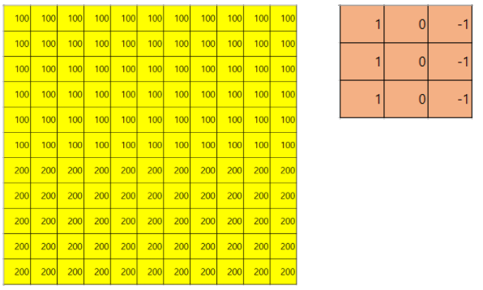

원본영상이 가로로 화소값이 변하는 형식이 아니라 위에서 아래로, 세로로 화소값이 변하는 형식이면 가로로 바뀌는 것만 인지하는 Prewitt -x 마스크는 아래 그림처럼 아무것도 추출하지 못하게 된다.

그래서 이럴땐 **Prewitt -Y 방법**을 쓰는 것!

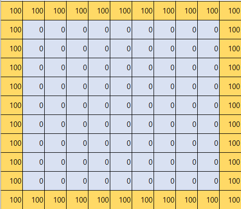

## Laplacian Mask

이런 원본영상이 있다고 치자.

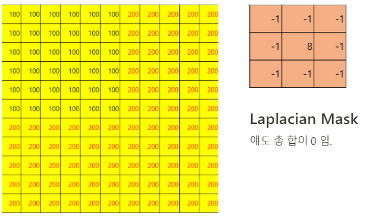

이렇게 라플라시안 마스크를 씌우면 100에서 200으로 바뀌는 구간이 가로 세로 둘다 있기 때문에

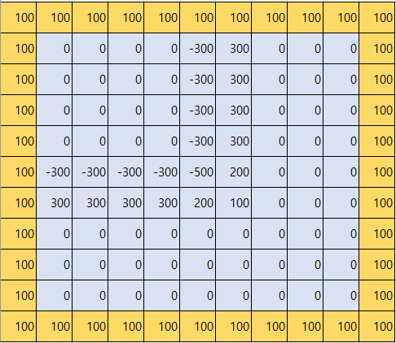

이런 결과가 뜬게 된다. 결국 이 친구도 경계를 검출하는 마스크라고 보면된다.

BUT! 단점이 있다.

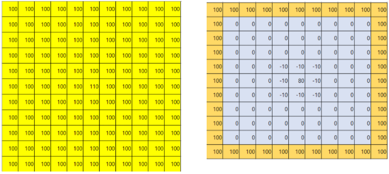

이렇게 원본영상에 딱 한 픽셀만 값이 다른 것을 노이즈 라고 하는데 라플라시안 마스크를 사용할 경우 이 노이즈를 더 퍼뜨리는 악효과가 발생한다.