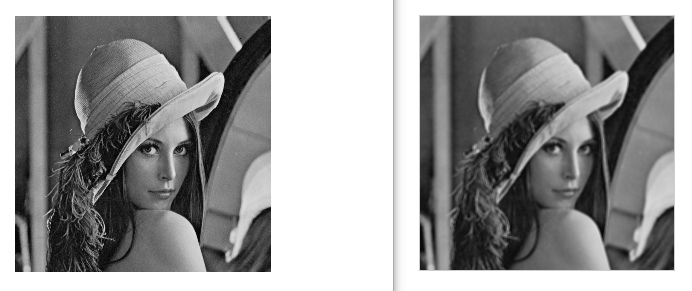
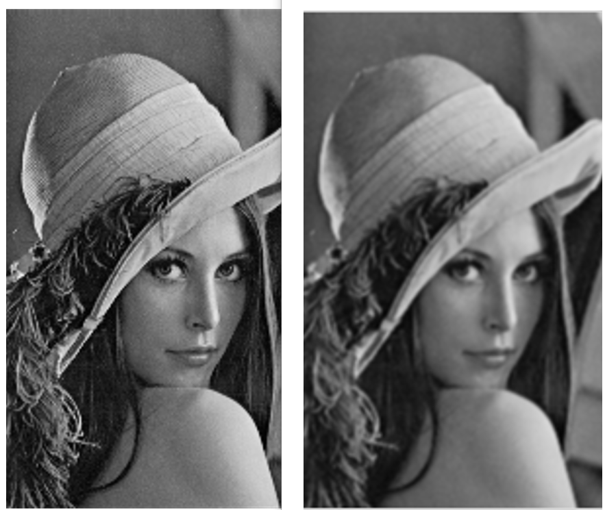
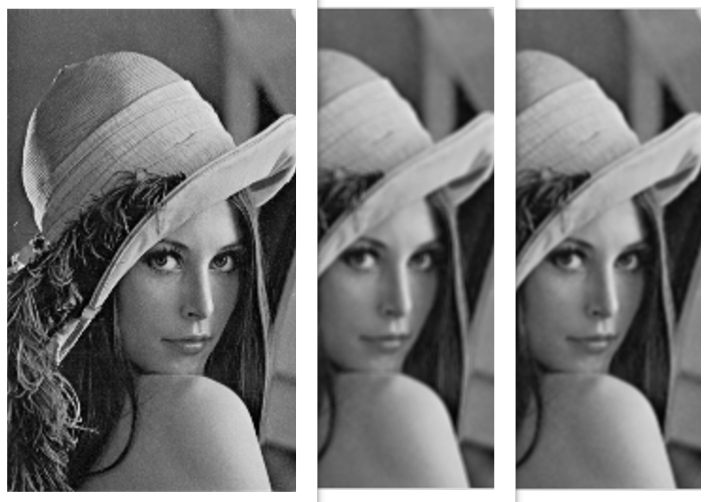
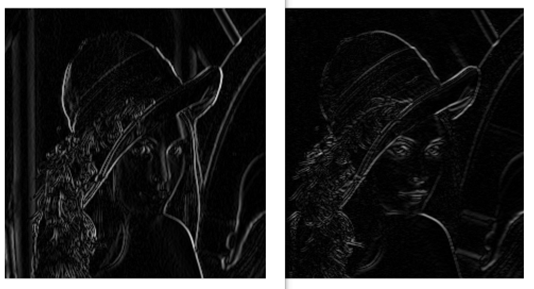
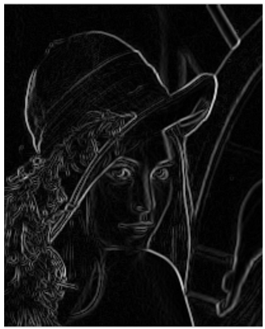
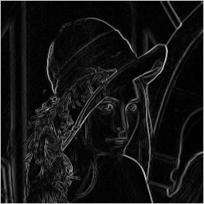
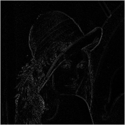
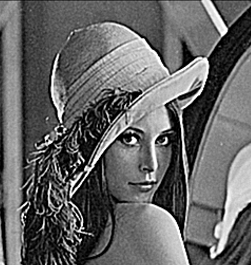

# Convolution Mask-코드

### 마스크 종류


### 박스 평활화 함수

```cpp
void AverageConv(BYTE* Img, BYTE* Out, int W, int H) // 박스평활화
{
	double Kernel[3][3] = {0.11111, 0.11111, 0.11111,
										0.11111, 0.11111, 0.11111,
										0.11111, 0.11111, 0.11111	};
	double SumProduct = 0.0;
	for (int i = 1; i < H-1; i++) { // Y좌표 (행)
		for (int j = 1; j < W-1; j++) { // X좌표 (열)
			for (int m = -1; m <= 1; m++) { // Kernel 행
				for (int n = -1; n <= 1; n++) { // Kernel 열
					SumProduct += Img[(i+m)*W + (j+n)] * Kernel[m+1][n+1];
				}
			}
			Out[i * W + j] = (BYTE)SumProduct;
			SumProduct = 0.0;
		}
	}
}
```

```cpp
double Kernel[3][3] = {0.11111, 0.11111, 0.11111,
										0.11111, 0.11111, 0.11111,
										0.11111, 0.11111, 0.11111	};
```

커널에는 각 칸에 1/9이 들어가야한다.

사실은 화소값들은 1차원배열에 들어가 있는 것과 마찬가지인데 이를 2차원 배열로 표현하면 예를들어 3열 2행에 있는 애를 바꾸고 싶으면 1차원 배열에서의 위치는 `행*2차원배열일때의 가로 사이즈 + 열` 로 계산이 가능하다. 그래서 `Img[i*W+j]` 을 기본으로 잡고 가는 것,

배열의 인덱스는 음수부터 시작하지 못하기 때문에 `Kernel[m+1][n+1]` 로 써준다.

**박스** **평활화 결과**



→ **평활화를 시켰더니 살짝 뿌옇게 나온 것을 확인할 수 있다. (경계지점들이 다 모호해지는  것임. 고주파 성질들을 다 걸러낸것.)**

### 가우시안 평활화 함수

```cpp
void GaussAvrConv(BYTE* Img, BYTE* Out, int W, int H) // 가우시안평활화
{
	double Kernel[3][3] = {0.0625, 0.125, 0.0625,
										0.125, 0.25, 0.125,
										0.0625, 0.125, 0.0625 };
	double SumProduct = 0.0;
	for (int i = 1; i < H - 1; i++) { // Y좌표 (행)
		for (int j = 1; j < W - 1; j++) { // X좌표 (열)
			for (int m = -1; m <= 1; m++) { // Kernel 행
				for (int n = -1; n <= 1; n++) { // Kernel 열
					SumProduct += Img[(i + m) * W + (j + n)] * Kernel[m + 1][n + 1];
				}
			}
			Out[i * W + j] = (BYTE)SumProduct;
			SumProduct = 0.0;
		}
	}
}
```

가우시안 평활화 같은 경우에는 총 더했을때 16이 나오기 때문에 커널에는 각 칸에 1/16, 2/16, 4/16이 들어가야한다.

다른 코드들은 박스 평활화 코드와 같음

**가우시안** **평활화 결과**



**박스 평활화와 가우시안 평활화의 차이점**



왼쪽부터 원본 - 박스평활화 - 가우시안 평활화이다. 이렇게 비교해서 보면 박스 평활화보다 가우시안 평활화가 경계선이 더 구분되어 있다는 것을 알 수 있다.

### Prewitt -X, Prewitt -Y 함수

```cpp
void Prewitt_X_Conv(BYTE* Img, BYTE* Out, int W, int H) // Prewitt 마스크 X
{
	double Kernel[3][3] = { -1.0, 0.0, 1.0,
										-1.0, 0.0, 1.0,
										-1.0, 0.0, 1.0 };
	double SumProduct = 0.0;
	for (int i = 1; i < H - 1; i++) { // Y좌표 (행)
		for (int j = 1; j < W - 1; j++) { // X좌표 (열)
			for (int m = -1; m <= 1; m++) { // Kernel 행
				for (int n = -1; n <= 1; n++) { // Kernel 열
					SumProduct += Img[(i + m) * W + (j + n)] * Kernel[m + 1][n + 1];
				}
			}
			// 0 ~ 765  =====> 0 ~ 255
			Out[i * W + j] = abs((long)SumProduct) / 3;
			SumProduct = 0.0;
		}
	}
}
```

```cpp
void Prewitt_Y_Conv(BYTE* Img, BYTE* Out, int W, int H) // Prewitt 마스크 X
{
	double Kernel[3][3] = { -1.0, -1.0, -1.0,
										0.0, 0.0, 0.0,
										1.0, 1.0, 1.0 };
	double SumProduct = 0.0;
	for (int i = 1; i < H - 1; i++) { // Y좌표 (행)
		for (int j = 1; j < W - 1; j++) { // X좌표 (열)
			for (int m = -1; m <= 1; m++) { // Kernel 행
				for (int n = -1; n <= 1; n++) { // Kernel 열
					SumProduct += Img[(i + m) * W + (j + n)] * Kernel[m + 1][n + 1];
				}
			}
			// 0 ~ 765  =====> 0 ~ 255
			Out[i * W + j] = abs((long)SumProduct) / 3; //음수가 나올 수 있기때문에 abs 처리
			SumProduct = 0.0;
		}
	}
}
```

총합이 0 이어야 하므로 얘는 뭐 커널에 나눈채로 넣어주고 할 필요가 없음

그런데 마이너스 값이 있기 때문에 이 Prewitt 마스크를 이용해서 나올 수 있는 값의 범위가 765까지 나올 수 있음, BUT! 화소값은 255까지 가능하므로 이를 처리해줄 필요가 있기에 `abs((long)SumProduct) / 3` 여기서 3을 나눠주는 것임.

**Prewitt -X, -Y 결과**



왼쪽이 -X, 오른쪽이 -Y이다.

보면 -x는 가로로 화소값 차이가 날 경우에만 경계값 처리를 해준 것을 확인할 수 있고, -Y는 반대로 세로로 화소값 차이가 나는 경우에만 경계값처리를 한게 보인다.

### Prewitt -X, Prewitt -Y 둘다 적용된 영상을 출력하고 싶다! 한다면...

`BYTE * Temp = (BYTE*)malloc(ImgSize); // 임시배열` 일단 Prewitt -X 마스크를 적용한 영상을 담을 임시배열을 만들어놓고 그 영상을 Prewitt -Y에 넣어 돌리면 된다!

그리고 main 안에서...

```cpp
Prewitt_X_Conv(Image, Temp, hInfo.biWidth, hInfo.biHeight);
Prewitt_Y_Conv(Image, Output, hInfo.biWidth, hInfo.biHeight);
	for (int i = 0; i < ImgSize; i++) {
		if (Temp[i] > Output[i]) {
			Output[i] = Temp[i];
		}
	}
```

이렇게 해주는데 여기서 for문을 따로 만들어준 이유는 Prewitt -Y가 적용된 Output 영상과 Prewitt -X가 적용된 Temp 영상의 경계선중에서 가장 경계선이 뚜렷하게 나온 애들만 Output에 다시 넣어주게 하여 -Y에서 안보이던 부분을 -X가, -X에서 안보이던 부분을 -Y가 채워주면서 아래 그림처럼 전반적으로 경계선이 다 나타나는 그러한 영상을 출력할 수 있었던 것이다.



### Sobel Mask 함수

```cpp
void Sobel_X_Conv(BYTE* Img, BYTE* Out, int W, int H) // Prewitt 마스크 X
{
	double Kernel[3][3] = { -1.0, 0.0, 1.0,
										-2.0, 0.0, 2.0,
										-1.0, 0.0, 1.0 };
	double SumProduct = 0.0;
	for (int i = 1; i < H - 1; i++) { // Y좌표 (행)
		for (int j = 1; j < W - 1; j++) { // X좌표 (열)
			for (int m = -1; m <= 1; m++) { // Kernel 행
				for (int n = -1; n <= 1; n++) { // Kernel 열
					SumProduct += Img[(i + m) * W + (j + n)] * Kernel[m + 1][n + 1];
				}
			}
			// 0 ~ 1020  =====> 0 ~ 255
			Out[i * W + j] = abs((long)SumProduct) / 4;
			SumProduct = 0.0;
		}
	}
}

void Sobel_Y_Conv(BYTE* Img, BYTE* Out, int W, int H) // Prewitt 마스크 X
{
	double Kernel[3][3] = { -1.0, -2.0, -1.0,
										0.0, 0.0, 0.0,
										1.0, 2.0, 1.0 };
	double SumProduct = 0.0;
	for (int i = 1; i < H - 1; i++) { // Y좌표 (행)
		for (int j = 1; j < W - 1; j++) { // X좌표 (열)
			for (int m = -1; m <= 1; m++) { // Kernel 행
				for (int n = -1; n <= 1; n++) { // Kernel 열
					SumProduct += Img[(i + m) * W + (j + n)] * Kernel[m + 1][n + 1];
				}
			}
			// 0 ~ 765  =====> 0 ~ 255
			Out[i * W + j] = abs((long)SumProduct) / 4;
			SumProduct = 0.0;
		}
	}
}
```

sobel은 prewitt에서 마스크 형태와 255로 만들어주기 위해서 나누는 값 “ 4” 만 다르고 나머지는 같다.

**Sobel -X, -Y 결과**



근데 Sobel이나 Prewitt은 거의 차이가 없다고 봐도 무방

교..교수님도 왜인지 모르신다고 한다..!!

### Laplace Convolution Mask 함수

```cpp
void Laplace_Conv(BYTE* Img, BYTE* Out, int W, int H) // Prewitt 마스크 X
{
	double Kernel[3][3] = { -1.0, -1.0, -1.0,
										-1.0, 8.0, -1.0,
										-1.0, -1.0, -1.0 };
	double SumProduct = 0.0;
	for (int i = 1; i < H - 1; i++) { // Y좌표 (행)
		for (int j = 1; j < W - 1; j++) { // X좌표 (열)
			for (int m = -1; m <= 1; m++) { // Kernel 행
				for (int n = -1; n <= 1; n++) { // Kernel 열
					SumProduct += Img[(i + m) * W + (j + n)] * Kernel[m + 1][n + 1];
				}
			}
			// 0 ~ 2040  =====> 0 ~ 255
			Out[i * W + j] = abs((long)SumProduct) / 8;
			SumProduct = 0.0;
		}
	}
}
```

얘도 prewitt에서 마스크 형태와 255로 만들어주기 위해서 나누는 값 “ 8” 만 다르고 나머지는 같다.

**Laplacian 결과**



잘 안보일 수 있는데 확대 해서 보면 아주 작은 1픽셀에 해당하는 노이즈에도 반응을 해서 되게 희미하면서도 자글자글하게 경계선이 처리된 것을 볼 수 있다.

### Laplace Convolution Mask ver2함수

```cpp
void Laplace_Conv_DC(BYTE* Img, BYTE* Out, int W, int H) // Prewitt 마스크 X
{
	double Kernel[3][3] = { -1.0, -1.0, -1.0,
										-1.0, 9.0, -1.0,
										-1.0, -1.0, -1.0 };
	double SumProduct = 0.0;
	for (int i = 1; i < H - 1; i++) { // Y좌표 (행)
		for (int j = 1; j < W - 1; j++) { // X좌표 (열)
			for (int m = -1; m <= 1; m++) { // Kernel 행
				for (int n = -1; n <= 1; n++) { // Kernel 열
					SumProduct += Img[(i + m) * W + (j + n)] * Kernel[m + 1][n + 1];
				}
			}
			//Out[i * W + j] = abs((long)SumProduct) / 8;
			if (SumProduct > 255.0) Out[i * W + j] = 255;
			else if (SumProduct < 0.0) Out[i * W + j] = 0;
			else Out[i * W + j] = (BYTE)SumProduct;
			SumProduct = 0.0;
		}
	}
}
```

마스크를 보면 총 합이 1이 나오므로 원본 영상의 밝기를 유지한 채로 출력하겠다는 것.

그래서 클리핑처리를 해줌.

**Laplace Convolution Mask ver2 결과**

완전히 안보이던 노이즈들을 다 증폭시킨 것을 볼 수 있다.


그렇다면 이 자잘한 노이즈들을 없애면 되지 않을까?

→ 가우시안을 쓰고 라플라시안을 써보자!

→ **저역 통과를 시키고 고역통과를 시킨 것**

```cpp
GaussAvrConv(Image, Temp, hInfo.biWidth, hInfo.biHeight);
Laplace_Conv_DC(Image, Output, hInfo.biWidth, hInfo.biHeight);
```

이렇게 쓰면 결과는 아래 영상처럼 나온다. 확실히 노이즈가 사라진걸 확인할 수 있다..!


