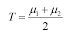

## Gonzalez, Woods : 경계값 자동 결정 방법

- 경계값 T의 초기값을 추정(중간점)
- 경계값 T로 이진화(영상분할) 함. 그 결과 밝기값이 T보다 큰 화소로 구성된 영역(G1) 과 밝기값이 T보다 작은 화소들로 구성된 영역 (G2)의 화소들로 나누어짐.
- 영억 G1에 대해서 화소들의 밝기의 평균값(u1+u2)을 계산
- 연속적으로 다음과 같은 새로운 경계값을 계산

  

- 연속적인 반복에서 경계값의 변화가 미리 정의된 오차, E보다 작을 때까지 단계 2에서 4까지 반복

위 단계를 차근차근 따르면 됨.

```cpp
//휴먼지능정보공학전공 201910782 김성은
#pragma warning(disable:4996)
#include <stdio.h>
#include <stdlib.h>
#include <Windows.h>

// 히스토그램 
void ObtainHistogram(BYTE* Img, int* Histo, int W, int H) {
	int ImgSize = W * H;

	for (int i = 0; i < ImgSize; i++) {
		Histo[Img[i]]++;
	}
}

// 이진화
void Binarization(BYTE* Img, BYTE* Out, int W, int H, BYTE Threshold) {
	int ImgSize = W * H;

	for (int i = 0; i < ImgSize; i++) {
		if (Img[i] < Threshold) { // 임계치보다 작으면 0
			Out[i] = 0;
		}
		else { 
			Out[i] = 255;
		}
	}
}

// 초기 임계치
BYTE Gonzalez(int* H) { //배열 받아옴
	BYTE ep = 3; //입실론 값 제한
	BYTE low, high=0;
	int m1 = 0, m2 = 0;
	int cnt1 = 0, cnt2 = 0;
	int mu1, mu2;

	for (int i = 0; i < 256; i++) {	// 밝기 최소값	
		if (H[i] > 0) {
			low = i;
			break;
		}
	}
	for (int i = 255; i >= 0; i--) { // 밝기 최대값	
		if (H[i] > 0) {
			high = i;
			break;
		}
	}

	int Thr = (low + high) / 2;
	while (1) {
		for (int i = Thr + 1; i <= high; i++) {
			m1 += (H[i] * i); //밝기값의 개수 * 밝기값
			cnt1 += H[i];
		}

		for (int i = low; i <= Thr; i++) {
			m2 += (H[i] * i);
			cnt2 += H[i];
		}
		if (cnt1 == 0) cnt1 = 1;
		if (cnt2 == 0) cnt2 = 1;
		mu1 = m1 / cnt1;
		mu2 = m2 / cnt2;

		int NewTh = (mu1 + mu2) / 2;

		if (abs(NewTh - Thr) < ep) {
			Thr = NewTh;
			break;
		}
		else {
			Thr = NewTh;
		}
		m1 = m2 = cnt1 = cnt2 = 0;
	}
	return Thr;
}

BYTE GonzalezSol(int* H) { //배열 받아옴
	BYTE ep = 3;
	BYTE low, high = 0;
	int G1 = 0, G2 = 0, cnt1 = 0, cnt2 = 0; //cnt는 개수
	int mu1, mu2;

	for (int i = 0; i < 256; i++) {
		if (H[i] != 0) {
			low = i;
			break;
		}
	}
	for (int i = 255; i >= 0; i--) {
		if (H[i] != 0) {
			high = i;
			break;
		}
	}

	BYTE Thr = (low + high) / 2;
	printf("%d\n", Thr);
	while (1) {
		for (int i = Thr + 1; i <= high; i++) {
			G1 += (H[i] * i); //H[i] i라는 밝기값을 가지는 화소들의 개수 * 밝기값
			cnt1 += H[i];
		}
		for (int i = low; i <= Thr; i++) {
			G2 += (H[i] * i);
			cnt2 += H[i];
		}
		if (cnt1 == 0)cnt1 = 1;
		if (cnt2 == 0)cnt2 = 1;
		mu1 = G1 / cnt1;
		mu2 = G2 / cnt2;

		BYTE newTh = (mu1 + mu2) / 2;

		if (abs(newTh - Thr) < ep) {
			Thr = newTh;
			break;
		}
		else {
			Thr = newTh;
		}
		G1 = G2 = cnt1 = cnt2 = 0;
		printf("%d\n", Thr);
	}
	return Thr;//임계치값
}

int main() {
	// -----------------------------------
	// 영상 입력
	BITMAPFILEHEADER hf; // 14 bytes
	BITMAPINFOHEADER hinfo; // 40 bytes
	RGBQUAD hRGB[256]; // 1024 bytes

	FILE* fp; 
	fp = fopen("coin.bmp", "rb"); // 파일 오픈, 읽기 위해 rb(read binary) , 이미지 파일은 전부 binary
	if (fp == NULL) {
		printf("File not found!/n");
		return -1;
	}
	fread(&hf, sizeof(BITMAPFILEHEADER), 1, fp);
	fread(&hinfo, sizeof(BITMAPINFOHEADER), 1, fp); 
	fread(hRGB, sizeof(RGBQUAD), 256, fp); 
	int ImgSize = hinfo.biWidth * hinfo.biHeight;
	BYTE* Image = (BYTE*)malloc(ImgSize);
	BYTE* Output = (BYTE*)malloc(ImgSize); // 영상 처리 결과 담기
	fread(Image, sizeof(BYTE), ImgSize, fp); // 영상의 화수 정보 담기
	fclose(fp); //파일 포인터와 영성파일 간의 연결 끊기

	//---------------------------------------
	// 영상 처리

	//int Histo[256] = { 0 }; // 히스토그램
	//BYTE Th;

	//ObtainHistogram(Image, Histo, hinfo.biWidth, hinfo.biHeight); // 히스토그램
	//Th = Gonzalez(Histo); // 경계값 T 초기값
	//Binarization(Image, Output, hinfo.biWidth, hinfo.biHeight, Th); // 이진화

	//솔루션---------------------------------
	int H = hinfo.biHeight, W = hinfo.biWidth;
	int Histo[256] = { 0 }; // 히스토그램
	int AHisto[256] = { 0 };

	BYTE Th;
	ObtainHistogram(Image, Histo, W, H); // 히스토그램
	Th = GonzalezSol(Histo); // 경계값 T 초기값
	Binarization(Image, Output, W, H, Th); // 이진화

	//---------------------------------------
	// 처리 결과 출력
	//fp = fopen("output.bmp", "wb");
	fp = fopen("output_sol.bmp", "wb"); //bmp파일 생성, wb = write binary
	fwrite(&hf, sizeof(BYTE), sizeof(BITMAPFILEHEADER), fp); // fwrite(저장할 변수, 크기, 횟수, 현재 파일 포인터)
	fwrite(&hinfo, sizeof(BYTE), sizeof(BITMAPINFOHEADER), fp); // 기록을 할때는 1byte 단위로 해야함
	fwrite(hRGB, sizeof(RGBQUAD), 256, fp);
	fwrite(Output, sizeof(BYTE), ImgSize, fp); // 영상 처리 결과 출력
	fclose(fp); // 파일포인터와 영상파일 관계 끊기

	free(Image); // 동적할당 해제 
	free(Output); // 하지않으면 memory leak 현상발생

	return 0;
}
```

**main 부터 보면,**

`BYTE Th;` : 경계값을 받아올 BYTE 변수를 만들어준다.

`ObtainHistogram(Image, Histo, W, H);` : 히스토그램부터 만들어주고

`Th = GonzalezSol(Histo);` : 경계값 T 초기값을 뽑아낸다.

`Binarization(Image, Output, W, H, Th);` : 뽑아낸 Th 경계값을 중심으로 이진화를 진행하면 되는 것!

곤잘레스 코드를 한번 살펴 보면,

```cpp
BYTE GonzalezSol(int* H) { //배열 받아옴
	BYTE ep = 3;
	BYTE low, high = 0; // 가장 밝은 값, 낮은 값
	int G1 = 0, G2 = 0, cnt1 = 0, cnt2 = 0; //cnt는 개수
	int mu1, mu2; // 평균밝기

	for (int i = 0; i < 256; i++) {
		if (H[i] != 0) {
			low = i;
			break;
		}
	}
	for (int i = 255; i >= 0; i--) {
		if (H[i] != 0) {
			high = i;
			break;
		}
	}

	BYTE Thr = (low + high) / 2;
	printf("%d\n", Thr);
	while (1) {
		for (int i = Thr + 1; i <= high; i++) {
			G1 += (H[i] * i); //H[i] i라는 밝기값을 가지는 화소들의 개수 * 밝기값
			cnt1 += H[i];
		}
		for (int i = low; i <= Thr; i++) {
			G2 += (H[i] * i);
			cnt2 += H[i];
		}
		if (cnt1 == 0)cnt1 = 1;
		if (cnt2 == 0)cnt2 = 1;
		mu1 = G1 / cnt1;
		mu2 = G2 / cnt2;

		BYTE newTh = (mu1 + mu2) / 2;

		if (abs(newTh - Thr) < ep) {
			Thr = newTh;
			break;
		}
		else {
			Thr = newTh;
		}
		G1 = G2 = cnt1 = cnt2 = 0;
		printf("%d\n", Thr);
	}
	return Thr;//임계치값
}
```

1. 초기 임계치 설정

    ```cpp
    for (int i = 0; i < 256; i++) {
    		if (H[i] != 0) {
    			low = i;
    			break;
    		}
    	}
    	for (int i = 255; i >= 0; i--) {
    		if (H[i] != 0) {
    			high = i;
    			break;
    		}
    	}
    
    	BYTE Thr = (low + high) / 2; //초기 임계치
    ```

   초기 임계치는 영상에서 가장 밝은 화소, 가장 어두운 화소의 중간값으로 정하고 가기로 했기 때문에 구해주고 시작

2. 경계값 T로 이진화(영상분할) 함. 그 결과 밝기값이 T보다 큰 화소로 구성된 영역(G1) 과 밝기값이 T보다 작은 화소들로 구성된 영역 (G2)의 화소들로 나누어짐.
3. 영역 G1에 대해서 화소들의 밝기의 평균값(u1+u2)을 계산

    ```cpp
    for (int i = Thr + 1; i <= high; i++) {
    			G1 += (H[i] * i); //H[i] i라는 밝기값을 가지는 화소들의 개수 * 밝기값
    			cnt1 += H[i];
    		}
    		for (int i = low; i <= Thr; i++) {
    			G2 += (H[i] * i);
    			cnt2 += H[i];
    		}
    		if (cnt1 == 0)cnt1 = 1;
    		if (cnt2 == 0)cnt2 = 1;
    		mu1 = G1 / cnt1;
    		mu2 = G2 / cnt2;
    ```

   임계치보다 밝은 영역을 G1, 임계치보다 어두운 영역을 G2로 만들어주는 것

   일단 각 영역의 평균값을 구해야하는데 일단 밝기 화소 값들의 합은 G1,G2로 나오는데 그 안의 화소 개수들을 모르니 cnt라는 변수가 필요한 것.

   `if (cnt1 == 0)cnt1 = 1;` : cnt가 0일경우 mu 즉, 평균을 구할 때 나눌 수가 없으므로 예외처리를 해줘야함.

4. 연속적으로 다음과 같은 새로운 경계값을 계산

   

   `BYTE newTh = (mu1 + mu2) / 2;` : 공식 그대로 사용해주고 newTh라는 새로운 경계값에 값을 넣어주면 됨.

5. 연속적인 반복에서 경계값의 변화가 미리 정의된 오차, E보다 작을 때까지 단계 2에서 4까지 반복

   `BYTE ep = 3;` : 코드 초반에 정의되어있던 이 ep 변수가 미리 정의된 오차라고 보면 된다.

    ```cpp
    if (abs(newTh - Thr) < ep) {
    			Thr = newTh;
    			break;
    		}
    ```

   이렇게 `newTh-Thr` 경계값의 변화가 ep (오차) 보다 작을 때까지 반복 시켜주고 작아지면 그때 Thr에 최적화되어서 나온 경계값을 결과적으로 넣어주고 끝내면 된다.

   `G1 = G2 = cnt1 = cnt2 = 0;` : 반복문을 돌릴 때 그때 그때 영역을 분석하면서 경계값을 찾아줘야하므로 0으로 초기화를 꼭 해줘야한다.