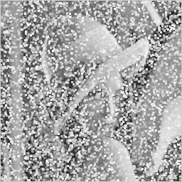
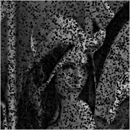

```cpp
/* Median filtering */
	BYTE temp[9];
	int W = hInfo.biWidth, H = hInfo.biHeight;
	int i, j;
	for (i = 1; i < H - 1; i++) {
		for (j = 1; j < W - 1; j++) {
			temp[0] = Image[(i - 1) * W + j-1];
			temp[1] = Image[(i - 1) * W + j];
			temp[2] = Image[(i - 1) * W + j+1];
			temp[3] = Image[i * W + j-1];
			temp[4] = Image[i * W + j]; //i,j 좌표
			temp[5] = Image[i * W + j+1];
			temp[6] = Image[(i + 1) * W + j-1];
			temp[7] = Image[(i + 1) * W + j];
			temp[8] = Image[(i + 1) * W + j+1];
			Output[i * W + j] = Median(temp, 9);
			//Output[i * W + j] = MaxPooling(temp, 9);
			//Output[i * W + j] = MinPooling(temp, 9);
		}
	}
```

센터를 기준으로 왼쪽에 있는 화소는 j-1, 오른쪽에 있는 화소는 j+1

i,j 좌표를 기준으로 위에 있는 애들은 i-1행에 해당, 아래는 i+1행에 해당

그니까 이 코드는 아래처럼 마스크가 형성 되는 것.

| temp[0] | temp[1] | temp[2] |
| --- | --- | --- |
| temp[3] | temp[4] | temp5] |
| temp[6] | temp[7] | temp[8] |

## Median 함수

```cpp
BYTE Median(BYTE* arr, int size)
{
	// 오름차순 정렬
	const int S = size;
	for (int i = 0; i < size - 1; i++) // pivot index
	{
		for (int j = i + 1; j < size; j++) // 비교대상 index
		{
			if (arr[i] > arr[j]) 	swap(&arr[i], &arr[j]);
		}
	}
	return arr[S/2]; //중간값
}

void swap(BYTE* a, BYTE* b) 
{
	BYTE temp = *a;
	*a = *b;
	*b = temp;
}
```

오름차순 정렬을 해주는데 기본적으로 Bubble Sorting 알고리즘을 따른다.

그래서 swap함수가 필요한 것

이 미디언 필터링을 impulse 노이즈가 있는 영상에 적용한 결과

훨씬 깔끔해진 것을 볼 수 있다.


사실 Pepper & Salt 노이즈가 위 영상처럼 같이 존재하는 것도 있지만

Pepper 노이즈만 존재하거나 Salt 노이즈만 존재하거나 하는 경우도 있어서

Pepper를 처리해주는 방법, Salt 노이즈를 처리해주는 방법이 따로 있다.

### MaxPooling 함수

```cpp
BYTE MaxPooling(BYTE* arr, int size)
{
	// 오름차순 정렬
	const int S = size;
	for (int i = 0; i < size - 1; i++) // pivot index
	{
		for (int j = i + 1; j < size; j++) // 비교대상 index
		{
			if (arr[i] > arr[j]) 	swap(&arr[i], &arr[j]);
		}
	}
	return arr[S-1];
}
```

중간값이 아니라 제일 큰 값을 반환시키는 방법이다. 이 방법은 Pepper 노이즈를 처리하므로 Salt 노이즈가 굉장히 증폭되어서 나타나게 된다.

**결과**



### MinPooling 함수

```cpp
BYTE MinPooling(BYTE* arr, int size)
{
	// 오름차순 정렬
	const int S = size;
	for (int i = 0; i < size - 1; i++) // pivot index
	{
		for (int j = i + 1; j < size; j++) // 비교대상 index
		{
			if (arr[i] > arr[j]) 	swap(&arr[i], &arr[j]);
		}
	}
	return arr[0];
}
```

이는 가장 작은 값을 반환하는 방법이고 Salt 노이즈를 처리하는 방법이다.

**결과**



### Median Filtering의 특징

미디언 필터는 **임펄스 노이즈를 가지고 있는 영상에만 깔끔하게 처리가 가능**하다. 임펄스 노이즈 자체가 노이즈들의 각각의 화소값들이 주변값과는 상대적으로 튀는 특정값을 가지고 있고 그 화소값 차이가 확연하기 때문에 중간값을 뽑아내기가 쉬운데

BUT **가우시안 노이즈** 영상 같은 경우에는 각 노이즈들이 **주변 화소값들과의 차이가 별로 나지 않기 때문에** 미디언 필터링을 사용할 경우 노이즈가 더 증폭되어버려서 비효과적인 것을 볼 수 있다.

> **임펄스 노이즈에는 Median Filtering을, 가우시안 노이즈에는 Avarage Filtering을 해주자.**