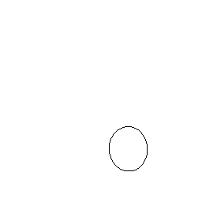
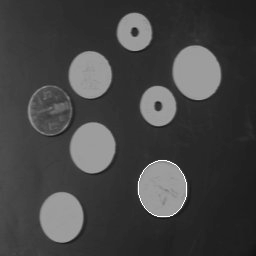
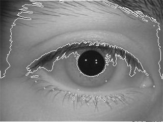
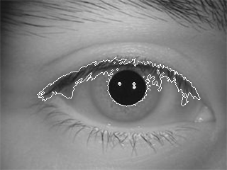
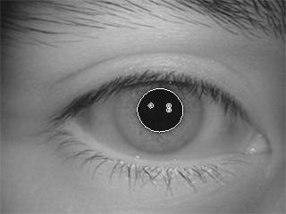

# 경계 검출

경계를 검출 하는 과정은 일단 맨 첫번째 화소부터 시작해서 화소를 쭉쭉쭉 검사를 해 나가다가 배경이 아닌 전경 화소를 마주하면 거기서부터 4주변화소 검사 혹은 8 주변화소 검사법을 시행해서 주변화소에 배경 화소가 잡힌다? 그럼 그 전경화소는 “경계”라고 인식이되는 것이다.

메인 함수에서 영상처리 코드를 작성해주자,

```cpp
//경계값 검출
	Binarization(Image, Temp, W, H, 100);
	//InverseImage(Output, Output, W, H);
	m_BlobColoring(Temp, H, W);
	for (int i = 0; i < ImgSize; i++) Output[i] = 255;
	for (int i = 0; i < H; i++) {
		for (int j = 0; j < W; j++) {
			if (Temp[i * W + j] == 0) {//전경화소라면
				if (!(Temp[(i - 1) * W + j] == 0 && Temp[(i + 1) * W + j] == 0 &&
					Temp[i * W + j - 1] == 0 && Temp[i * W + j + 1] == 0))
					//왼쪽 오른쪽 위 아래가 다 0이 아니라면.. 즉, 한 곳이라도 전경화소가 아닌 화소가 포함되어있다면
					Output[i*W+j] = 0;
			}
		}
	}
```

경계값에 해당하는 화소들에만 0을 채워주는 것이다. 나머지는 다 255로 만들어주고,,.!

**경계검출 결과**



이렇게 나온다!

원본 영상 위에 경계가 출력되도록 해보자

```cpp
for (int i = 0; i < ImgSize; i++) Output[i] = Image[i]; //원본이미지를 넣어주기
.
.
.
Output[i*W+j] = 255; // 경계를 밝게
```



### 경계검출 함수(따로 코드를 빼기)

```cpp
void BinaryImageEdgeDetection(BYTE* Bin, BYTE* Out, int W, int H)
{
	for (int i = 0; i < H; i++) {
		for (int j = 0; j < W; j++) {
			if (Bin[i * W + j] == 0) // 전경화소라면
			{
				if (!(Bin[(i - 1) * W + j] == 0 && Bin[(i + 1) * W + j] == 0 &&
					Bin[i * W + j - 1] == 0 && Bin[i * W + j + 1] == 0)) // 4방향 화소 중 하나라도 전경이 아니라면
					Out[i * W + j] = 255;
			}
		}
	}
}
```

## 사람의 동공 영상을 처리해보자

위에 경계값 출력 코드를 사람 동공 영상에 적용 시켜보면, 아래 처럼 나온다.



이렇게 나온 이유는 이진화 과정에서 배경과 전경을 잘못인식해서 저렇게 나오는 것.

이전에 썼던 코인 이미지는 배경이 어둡고 컴포넌트가 밝은 이미지였는데 이 동공영상은 배경이 밝고 동공이 완전 어둡게 나오므로 전경과 배경을 바꾸던가 해줘야한다.

이를 위해 초반에 했던 이미지 반전 코드를 활용해주면 된다.

```cpp
//동공 이미지 라벨링
	Binarization(Image, Temp, W, H, 100);
	InverseImage(Temp, Temp, W, H);
	m_BlobColoring(Temp, H, W);
	for (int i = 0; i < ImgSize; i++) Output[i] = Image[i];
	BinaryImageEdgeDetection(Temp, Output, W, H);
```


이렇게 해주면 확실히 외부 배경과 전경이 딱 나뉜건 했는데 영상 처리 중에 동공과 눈썹 부분이 연결되어있다고 인식이 되어서 같은 구역으로 라벨링이 된 문제가 발생했다.

이럴 경우에는 이 이진화 임계치가 너무 높아서 많은 영역이 연결되어버린것이다. 이진화 임계치를 낮춰주면 된다. 낮추게 되면,, 아래 이미지처럼 잘 나온다.

