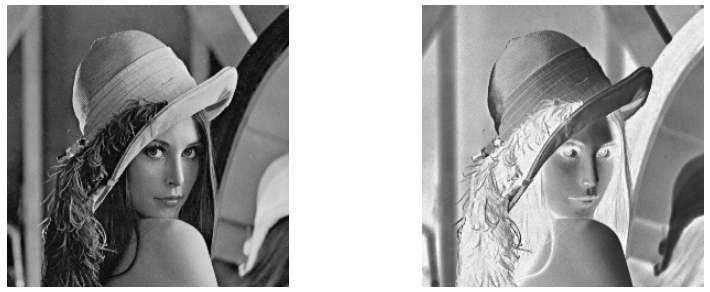
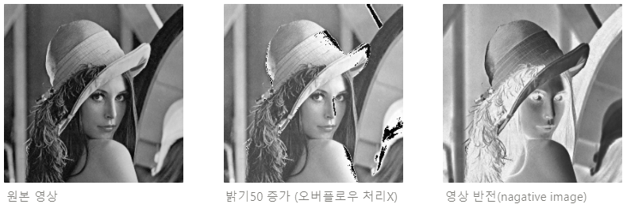

```cpp
//c++
#pragma warning(disable:4996)
#include <stdio.h>
#include <stdlib.h>
#include <Windows.h>
void main()
{
	BITMAPFILEHEADER hf; // BMP 파일헤더 14Bytes
	BITMAPINFOHEADER hInfo; // BMP 인포헤더 40Bytes
	RGBQUAD hRGB[256]; // 팔레트 (256 * 4Bytes)
	FILE* fp;
	fp = fopen("lenna.bmp", "rb");
	if (fp == NULL) return;
	fread(&hf, sizeof(BITMAPFILEHEADER), 1, fp);
	fread(&hInfo, sizeof(BITMAPINFOHEADER), 1, fp);
	fread(hRGB, sizeof(RGBQUAD), 256, fp);
	int ImgSize = hInfo.biWidth * hInfo.biHeight;
	BYTE* Image = (BYTE*)malloc(ImgSize);
	BYTE* Output = (BYTE*)malloc(ImgSize);
	fread(Image, sizeof(BYTE), ImgSize, fp);
	fclose(fp);
	/* 영상처리 */

	//영상반전
	for (int i = 0; i < ImgSize; i++)
		Output[i] = 255 - Image[i];

	fp = fopen("output.bmp", "wb");
	fwrite(&hf, sizeof(BYTE), sizeof(BITMAPFILEHEADER), fp);
	fwrite(&hInfo, sizeof(BYTE), sizeof(BITMAPINFOHEADER), fp);
	fwrite(hRGB, sizeof(RGBQUAD), 256, fp);
	fwrite(Output, sizeof(BYTE), ImgSize, fp);
	fclose(fp);
	free(Image);
	free(Output);
}
```

- 파일헤더 : 14bytes
- 인포헤더 : 40bytes
- 팔레트 : 256*4 bytes

`fread(&hf, sizeof(BITMAPFILEHEADER), 1, fp);` : 14Bytes만큼 읽어서 hf에 1번 담으라는 의미

`fread(&hInfo, sizeof(BITMAPINFOHEADER), 1, fp);` : 40Bytes만큼 읽어서 hInfo에 1번 담으라는 의미

`fread(hRGB, sizeof(RGBQAUD), 256, fp);` : sizeof(RGBQUAD)가 4바이트이니까 이걸 256번씩 읽어서 hRGB에 넣으라는 의미

`int ImgSize = hInfo.biWidth * hInfo.biHeight;` : 영상의 가로X세로 사이즈 전체 픽셀의 개수

`fread(Image, sizeof(BYTE), ImgSize, fp);` : 화소를 전부다(ImageSize) 읽어서 동적할당한 Image에 넣어주는 과정

`Output[i] = 255 - Image[i];` : 영상의 반전을 주는 영상 처리 코드 밝은건 어둡게 어두운건 밝게



코드결과 이렇게 영상이 출력된다.

### 응용 과제

```cpp
//c++
#pragma warning(disable:4996) 
#include <stdio.h>
#include <stdlib.h> 
#include <Windows.h> 

void ImageProcess(const char* FileName, BITMAPFILEHEADER hf, BITMAPINFOHEADER hinfo, RGBQUAD* hRGB, BYTE* Output, int ImgSize);

int main() {
	BITMAPFILEHEADER hf;
	BITMAPINFOHEADER hinfo;
	RGBQUAD hRGB[256];

	FILE* fp;
	fp = fopen("lenna.bmp", "rb"); //읽어오기
	if (fp == NULL) { //파일이 없을 때를 방지
		printf("File not found\n");
		return -1;
	}
	//-------영상 입력 단계-------
	fread(&hf, sizeof(BITMAPFILEHEADER), 1, fp); //14바이트 만큼 읽어서 hf에 담기
	fread(&hinfo, sizeof(BITMAPINFOHEADER), 1, fp); //40바이트 만큼 읽어서 hinfo에 담기
	fread(hRGB, sizeof(RGBQUAD), 256, fp); //4*256만큼 hRGB에 담기

	int ImgSize = hinfo.biWidth * hinfo.biHeight; //화소 정보 
	BYTE* Image = (BYTE*)malloc(ImgSize); //원래 영상의 화소정보를 넣은 배열
	BYTE* Output = (BYTE*)malloc(ImgSize); //처리된 결과를 담을 배열
	fread(Image, sizeof(BYTE), ImgSize, fp);
	fclose(fp); // 파일 포인터와 파일간의 관계 끊기

	//------이미지 처리 단계---------
	//output1.bmp: lenna.bmp 파일과 동일한 영상
	ImageProcess("output1.bmp", hf, hinfo, hRGB, Image, ImgSize);

	//output2.bmp: 원본 영상의 밝기값을 50만큼 증가시킨 영상 (별도 overflow로 인한 클리핑처리는 필요없음)
	for (int i = 0; i < ImgSize; i++) {
		Output[i] = Image[i] + 50;
	}
	ImageProcess("output2.bmp", hf, hinfo, hRGB, Output, ImgSize); //-> 오버플로우? 검정색 부자연스러운 부분이 생김

	//output3.bmp: 원본 영상의 반전 결과 영상(negative image)
	for (int i = 0; i < ImgSize; i++) {
		Output[i] = 255 - Image[i];
	}
	ImageProcess("output3.bmp", hf, hinfo, hRGB, Output, ImgSize);

	//-----------마무리------------
	free(Image); //메모리 낭비를 방지하기 위해서 없애주기
	free(Output);
	return 0;
}

//이미지 출력하는 코드가 겹치니 함수 생성 (fwrite에 필요한 변수들을 다 매개변수로 취급)
void ImageProcess(const char* FileName, BITMAPFILEHEADER hf, BITMAPINFOHEADER hinfo, RGBQUAD* hRGB, BYTE* Output, int ImgSize) {
	FILE* fp = fopen(FileName, "wb"); //출력
	fwrite(&hf, sizeof(BYTE), sizeof(BITMAPFILEHEADER), fp);
	fwrite(&hinfo, sizeof(BYTE), sizeof(BITMAPINFOHEADER), fp);
	fwrite(hRGB, sizeof(RGBQUAD), 256, fp);
	fwrite(Output, sizeof(BYTE), ImgSize, fp);
	fclose(fp);
}
```

영상처리 코드를 보면,

```cpp
for (int i = 0; i < ImgSize; i++) {
		Output[i] = Image[i] + 50;
	}
```

+50 을 해줬기 때문에 이는 원본영상의 밝기값을 50만큼 증가 시킨 영상

```cpp
for (int i = 0; i < ImgSize; i++) {
		Output[i] = 255 - Image[i];
	}
```

원본영상의 반전 결과 영상 = nagative Image

