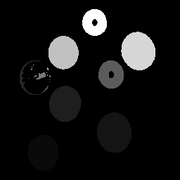

# 라벨링과 GrassFire 알고리즘,ROI

즁요한건 라벨링을 해준다는 것은 연결성을 분석 한다는 것이고 그 연결성을 분석해서 연결성이 있는 덩어리들 별로 서로 다른 identity를 부여해주는 것이다. 따라서 라벨링을 하기 위해서는 이진영상이 마련되어 있어야 하므로 이진화를 먼저 해주는게 맞다.

```cpp
/*main 함수 중..*/
Binarization(Image, Output, W, H, 30);
InverseImage(Output, Output, W, H);
m_BlobColoring(Output, H, W);
```

## 라벨링 함수

```cpp
int push(short* stackx, short* stacky, int arr_size, short vx, short vy, int* top)
{
	if (*top >= arr_size) return(-1);
	(*top)++;
	stackx[*top] = vx;
	stacky[*top] = vy;
	return(1);
}

int pop(short* stackx, short* stacky, short* vx, short* vy, int* top)
{
	if (*top == 0) return(-1);
	*vx = stackx[*top];
	*vy = stacky[*top];
	(*top)--;
	return(1);
}

// GlassFire 알고리즘을 이용한 라벨링 함수
void m_BlobColoring(BYTE* CutImage, int height, int width)
{
	int i, j, m, n, top, area, Out_Area, index, BlobArea[1000];
	long k;
	short curColor = 0, r, c;
	//	BYTE** CutImage2;
	Out_Area = 1;
	
	// 스택으로 사용할 메모리 할당
	short* stackx = new short[height * width];
	short* stacky = new short[height * width];
	short* coloring = new short[height * width];

	int arr_size = height * width;

	// 라벨링된 픽셀을 저장하기 위해 메모리 할당

	for (k = 0; k < height * width; k++) coloring[k] = 0;  // 메모리 초기화

	for (i = 0; i < height; i++)
	{
		index = i * width;
		for (j = 0; j < width; j++)
		{
			// 이미 방문한 점이거나 픽셀값이 255가 아니라면 처리 안함
			if (coloring[index + j] != 0 || CutImage[index + j] != 255) continue;
			r = i; c = j; top = 0; area = 1;
			curColor++;

			while (1)
			{
			GRASSFIRE:
				for (m = r - 1; m <= r + 1; m++)
				{
					index = m * width;
					for (n = c - 1; n <= c + 1; n++)
					{
						//관심 픽셀이 영상경계를 벗어나면 처리 안함
						if (m < 0 || m >= height || n < 0 || n >= width) continue;

						if ((int)CutImage[index + n] == 255 && coloring[index + n] == 0)
						{
							coloring[index + n] = curColor; // 현재 라벨로 마크
							if (push(stackx, stacky, arr_size, (short)m, (short)n, &top) == -1) continue;
							r = m; c = n; area++;
							goto GRASSFIRE;
						}
					}
				}
				if (pop(stackx, stacky, &r, &c, &top) == -1) break;
			}
			if (curColor < 1000) BlobArea[curColor] = area;
		}
	}

	float grayGap = 255.0f / (float)curColor;

	// 가장 면적이 넓은 영역을 찾아내기 위함 
	for (i = 1; i <= curColor; i++)
	{
		if (BlobArea[i] >= BlobArea[Out_Area]) Out_Area = i;
	}
	// CutImage 배열 클리어~ CutImage 배열이 메인에서의 Output이미지라고 보면 됨.
	for (k = 0; k < width * height; k++) CutImage[k] = 255; // 하얗게 채우기

	// coloring에 저장된 라벨링 결과중 (Out_Area에 저장된) 영역이 가장 큰 것만 CutImage에 저장
	for (k = 0; k < width * height; k++)
	{
		//if (coloring[k] == Out_Area) CutImage[k] = 0;  // 가장 큰 것만 저장 (size filtering)
		//if (BlobArea[coloring[k]] > 500) CutImage[k] = 0;  // 특정 면적이상되는 영역만 출력
		CutImage[k] = (unsigned char)(coloring[k] * grayGap); //라벨링 된거 그대로 출력
	}

	delete[] coloring;
	delete[] stackx;
	delete[] stacky;
}
```

라벨링 한 코드는 길어서 주석으로 보는게 편함.

주요하게 알아야할 요소들을 설명해보자면,

BlobArea가 각 컴포넌트의 크기가 들어가 있는 아이인데 이 친구를 통해서 가장 큰 컴포넌트만 출력을 시킨다거나 크기별로 내가 원하는 영역을 출력할 수 있다.

그리고 이 BlobArea를 통해서 총 몇개의 컴포넌트가 있는지를 알 수 있다.

curColor가 총 컴포넌트 개수를 의미하기도 한다.

그래서 `float grayGap = 255.0f / (float)curColor;` 이 코드가 각 컴포넌트를 구별하기 위해서 밝기값에 차이를 두도록 하는 코드인데 여기서 cutColor(컴포넌트 총 개수)를 255에 나누어 나온 몫만큼 밝기를 낮추며 적용시키는 것이다. 다음 결과이미지를 보면 어떤 건지 감이 온다.

**이진화 시킨 후 라벨링을 해준 결과**



맨 아래 for문에서 가장 큰 컴포넌트만 출력 시키기 위한 코드로

`if (coloring[k] == Out_Area) CutImage[k] = 0;` 를 써주면


이렇게 컴포넌트들 중에서 영역이 가장 큰 친구만 출력되어 나온다.