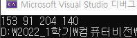
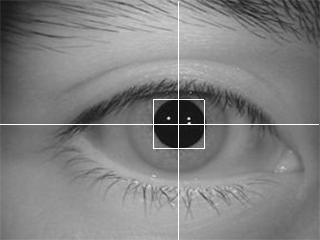

# 외접사각형 외곽라인 그리는 알고리즘 & 무게중심 구하는법

### [외접사각형 외곽라인 그리는 알고리즘]

**동공 이진화 및 라벨링까지 된 상태에서,**

1) 좌측상단부터 우방향 가로우선으로 탐색하다가, 0인화소를 처음 만났을 때의 Y좌표를 저장: y1

2) 우측하단부터 좌방향 가로우선으로 탐색하다가, 0인화소를 처음 만났을 때의 Y좌표를 저장: y2

3) 좌측상단부터 하방향 세로우선으로  탐색하다가, 0인화소를 처음 만났을 때의 X좌표를 저장: x1

4) 우측하단부터 상방향 세로우선으로  탐색하다가, 0인화소를 처음 만났을 때의 X좌표를 저장: x2

- 그러면 두 개의 점이 결정됨: (x1, y1), (x2, y2)
- 외접사각형의 4개 꼭지점 좌표: 좌상(x1, y1), 우상(x2, y1), 좌하(x1, y2), 우하(x2, y2)

5) line 4개 그리면 외접사각형 완성: 좌상 ~ 우상, 우상~ 우하, 좌하 ~ 우하, 좌상 ~ 좌하

단일 for문 4개로 그리면 되겠습니다.

### [무게중심 구하는법]

영상에서 특정 영역의 무게 중심을 구하는 방법은 다음과 같습니다.

1) 해당 영역의 X좌표 위치 모두 더해서 한 변수에 저장 (sumx)

2) 해당 영역의 Y좌표 위치 모두 더해서 한 변수에 저장 (sumy)

3) 해당 영역의 픽셀 갯수(cnt)로 저장된 변수(sumx 및 sumy)를 나눈 결과(cenx, ceny)가 무게중심임

메인함수 코드

```cpp
//동공 이미지 라벨링
	Binarization(Image, Output, W, H, 40);
	InverseImage(Output, Output, W, H);
	m_BlobColoring(Output, H, W);
	//for (int i = 0; i < ImgSize; i++) Output[i] = Image[i];
	//BinaryImageEdgeDetection(Temp, Output, W, H);

	int Cx, Cy;
	int LUX, LUY, RDX, RDY;

	Obtain2DCenter(Output, W, H, &Cx, &Cy); // 이진영상의 무게중심 구하기
	//Obtain2DBoundingBox(Output, W, H, &LUX, &LUY, &RDX, &RDY); // 이진영상의 외접직사각형 좌표 추출
	DrawCrossLine(Image, W, H, Cx, Cy);
	//DrawRectOutline(Image, W, H, LUX, LUY, RDX, RDY);

	SaveBMPFile(hf, hInfo, hRGB, Image, hInfo.biWidth, hInfo.biHeight, "output_center.bmp");
```

**무게중심 코드**

```cpp
void Obtain2DCenter(BYTE* Image, int W, int H, int* Cx, int* Cy)
{
	int SumX = 0, SumY = 0;
	int cnt = 0; 
	for (int i = 0; i < H; i++) {
		for (int j = 0; j < W; j++) {
			if (Image[i * W + j] == 0) // 동공영역이면
			{
				SumX += j;
				SumY += i;
				cnt++;
			}
		}
	}
	if (cnt == 0) 	cnt = 1;
	*Cx = SumX / cnt;
	*Cy = SumY / cnt;
	//printf("%d    %d\n", Cx, Cy);
}
```

**라인 드로잉**

```cpp
// Img: 가로/세로 라인을 그릴 이미지배열, W: 영상 가로사이즈, H: 영상 세로사이즈,
// Cx: 가로/세로 라인이 교차되는 지점의 X좌표
// Cy: 가로/세로 라인이 교차되는 지점의 Y좌표
void DrawCrossLine(BYTE* Img, int W, int H, int Cx, int Cy)
{
	for (int i = 0; i < W - 1; i++) // horizontal line
		Img[Cy * W + i] = 255;
	for (int i = 0; i < H - 1; i++) // vertical line
		Img[i * W + Cx] = 255;
}
```

**외접사각형 코드**

```cpp
void Obtain2DBoundingBox(BYTE* Image, int W, int H, int* LUX, int* LUY, int* RDX, int* RDY) 
{
	int flag = 0;
	for (int i = 0; i < H; i++) {
		for (int j = 0; j < W; j++) {
			if (Image[i * W + j] == 0) {
				*LUY = i;
				flag = 1; //속해있는 for문 두개를 한번에 나가기 위해서 쓰는 방법
				break;
			}
		}
		if (flag == 1) break;
	}
	flag = 0;
	for (int i = H - 1; i >= 0; i--) {
		for (int j = 0; j < W; j++) {
			if (Image[i * W + j] == 0) {
				*RDY = i;
				flag = 1;
				break;
			}
		}
		if (flag == 1) break;
	}
	flag = 0;

	for (int j = 0; j < W; j++) {
		for (int i = 0; i < H; i++) {
			if (Image[i * W + j] == 0) {
				*LUX = j;
				flag = 1;
				break;
			}
		}
		if (flag == 1) break;
	}
	flag = 0;
	for (int j = W - 1; j >= 0; j--) {
		for (int i = 0; i < H; i++) {
			if (Image[i * W + j] == 0) {
				*RDX = j;
				flag = 1;
				break;
			}
		}
		if (flag == 1) break;
	}
}
```

1. 화소를 처음부터 계속해서 탐색을 하다가 255가 아닌 값을 처음으로 만나게 되는데 그 점의 Y좌표를 LUY 좌표로 삼는다.
2. 영상의 화소 맨 오른쪽 맨 끝점 부터 왼쪽으로 쭉 탐색을 하다가 255가 아닌값을 처음으로 만나게되는데 그 점의 y좌표가 RDY 좌표로 삼는다.
3. 이제 다시 영상의 처음부터 0,0 부터 위에서 아래로 세로로 쭉쭉 탐색을 하다가 첨으로 255가 아닌 화소를 만나게 될텐데 그 좌표의 X좌표를 LUX좌표로 삼는다.
4. 똑같이 반대편에서도 아래에서 위로 쭉쭉 세로로 탐색을하다가 첨으로 255가 아닌 화소를 만나게 되면 그 점의 좌표의 X좌표를 RDX좌표를 삼는 것이다.

→ **이 과정을 그대로 코드화한것이다! 어렵지않음!**

**사각형 라인 드로잉**

```cpp
// Img: 사각형을 그릴 이미지배열, W: 영상 가로사이즈, H: 영상 세로사이즈,
// LU_X: 사각형의 좌측상단 X좌표, LU_Y: 사각형의 좌측상단 Y좌표,
// RD_X: 사각형의 우측하단 X좌표, LU_Y: 사각형의 우측하단 Y좌표.
void DrawRectOutline(BYTE* Img, int W, int H, int LU_X, int LU_Y, int RD_X, int RD_Y)
{
	for (int i = LU_X; i < RD_X; i++) 	Img[LU_Y * W + i] = 255;
	for (int i = LU_X; i < RD_X; i++) 	Img[RD_Y * W + i] = 255;
	for (int i = LU_Y; i < RD_Y; i++) 	Img[i * W + LU_X] = 255;
	for (int i = LU_Y; i < RD_Y; i++) 	Img[i * W + RD_X] = 255;	
}
```

사각형이기 때문에 각 변을 흰색으로 채워주는 과정을 만든다.

실제로 드로잉하기 전에

`printf("%d %d %d %d", LUX, LUY, RDX, RDY);` 을 넣어주면 각 좌표를 알 수 있는데

동공 영상 같은경우에는 좌표가



이렇게 나온다.

결과도 동공에 외접해있는 사각형, 동공의 무게중심을 교차하는 라인 모두 잘 그려져있는 것을 확인 할 수 있다.

