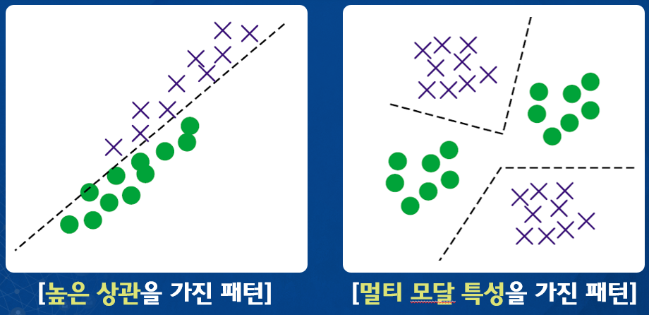

> 패턴인식보다 큰 범주가 인공지능
>
- 긍정적인 입장 → 모방게임
- 부정적인 입장 → 중국어 논증

**인지과학 > 인공지능 > 패턴인식**

- **특징과 패턴**
    - 객체가 가지는 고유릐 분별 가능한 측면, 질 혹은 특성
    - `특징` : 어떤 사물이나 현상을 정량적으로 표현할 수 있는 것
    - 처리할 수 있는 데이터 현태로 저장되고 표현되는 것이 특징
    - `패턴` : 그러한 특징들이 모여있을 때 보이는 추세

  

- **특징 그림(2D)**

  

  이렇게 특징들을 군집을 이루어서 있을 때가 패턴

  

    - `좋은 특징`을 쓰면 서로 다른 클래스들끼리 **잘 분리가 가능**
    - `나쁜 특징`은 서로 다른 클래스임에도 **겹쳐져있는거**

  > **패턴인식 과정에서 가장 중요한 문제는 분류**
  
    
  ---

  
    
  ---

  
    - **`높은 상관성`**이란 **가로방향**으로 특징값이 **증가**하면 세로방향의 값도 증가하는 것을 의미
    - **히스토그램이 두 개의 분포를 가질 때** `Multimodal` 또는 `Bimodal` 형태의 분포라 했는데 그 때 그 멀티모달임.
    

    - 이렇게 동일한 클래스가 두개의 군집을 이루고 있을때 멀티모달
---

### 패턴 인식 시스템의 구성요소와 사이클

**실세계** → **측정장치**(카메라) → **전처리**(다양한 영상처리, `좋은특징을 뽑아내는 과정`) → **차원 축소**(사용한 특징의 차원이 너무 고차원일 때, `PCA나 LDA같은 방법을 통해 좋은 성분만 선택`) → **인식, 예측**(`이 과정에 따라 성능이 좌우됨`) → **모델 선택** → **분석결과**

간단하게,

> **데이터 수집 → 특징 선택 → 모델선택 → 학습 → 인식**
>

`**학습**`이란 주어진 데이터를 기반으로 **기계를 학습**시키는 것

---

### 패턴인식의 유형과 분류기(문제와 유형)

- 분류(Binary Classification 둘 중에 뭐냐)
- 회귀(입력 값이 주어지면 출력값을 알려주는 것)
- 군집화(군집화는 덩어리 identity를 부여하는 방법)
- 서술(영상을 인식)

- 분류기

    

  왼쪽은 선형으로 나눈거 오른쪽은 비선형으로

  

  d개의 입력이 주어졌을 때 입력들의 다음 노드에 배치를 시켜서 다 연결을 시켜서 이 입력들이 어떤 식으로 결과값을 내는지에 따라 이 입력은 어떤 클래스에 해당이 되는지 할당해주는 것임.

  →일반적으로 신경망이라는게 이런 구조를 가지고 있음

### 패턴인식 알고리즘의 성능평가

- **혼동행렬** : `성능`을 평가할때 많이 사용

    |  | Actual Positive | Actual Negative |
    | --- | --- | --- |
    | Predicted Positive | TP | FP |
    | Predicted Negative | FN | TN |
    
        
  
    - **Binary Classification(이진분류)** 을 할 때는 항상 이렇게 네 가지 종류의 Rate(정확도 또는 에러)가 존재
    - 시스템 성능을 평가할때 사용하는 두 가지 지표가 있음
        - **Recall Rate(취소율)**
        
                
        - **정밀도(Positive 중에 진짜 True Positive인 애만)**
        
        
- **ROC 곡선**

    
    - 점수 = Feature
    - Roc : 임계값을 바꿔가면서 TP와 TN값을 점으로 찍어내면 커브형태가 되는데 그때 나오는 곡선

    
    - **FAR** = False Positive = False Acceptance
    - **TAR** = False Negative - 1
- 이 ROC 곡선을 적분을 하면 나오는 넓이(AURO)가 바로 **시스템의 성능**

    
    - 좌측 상단으로 커브가 가까울수록 시스템의 성능이 좋다는 것

  = **위 초록색으로 나와있는 커브와 빨간색으로 나와있는 커브가 많이 떨어져 있다는 것.**

  → 그래서 두 개의 분포가 전혀 겹치지 않으면 ROC 커브가 정의가 되지 않음 그냥 좌측상단에  하나의 점으로 정의 됨.

  > **AURO가 크면 클수록, 시스템의 성능이 더 좋다는 것을 나타냄**

---

### 추가 내용

- 인공지능은 측정장치를 통해 얻은 소스에서 특징을 선정하는 과정이 생략
- 이런 부분에서 딥러닝은 전통적인 패턴인식 방법과 가장 큰 차이를 보임